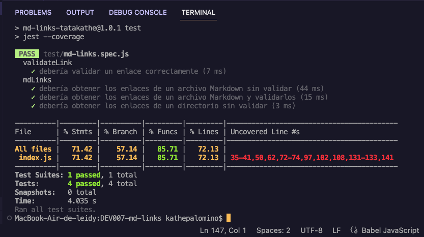

# Markdown Links

## Índice

* [1. Resumen del Proyecto ](#1-resumen-del-Proyecto)
* [2. Planificacion](#2-Planificacion)
* [3. Intalacion y Modo de Uso](#3-Instalacion-y-Modo-de-Uso)
* [4. Pruebas Unitarias ](#4-Pruebas-Unitarias)

***

## 1. Resumen del Proyecto

En este proyecto dispondras de una librería (o biblioteca - library) en JavaScript, asi como de una herramienta de línea de comando (CLI).  

Nuestra Libreria, se ejecuta con  [Node.js](https://nodejs.org/), y nos permite leer y analizar archivos en formato `Markdown`, para verificar los links que contengan y reportar algunas estadísticas.   

Estos archivos `Markdown` normalmente contienen _links_ (vínculos/ligas) que muchas veces están rotos o ya no son válidos y eso perjudica mucho el valor de la información que se quiere compartir.   

### Planificacion

Es por ello que, para visualizar mejor lo que tendrás que hacer y planificar tus tareas y objetivos, es recomendable hacer un
`diagrama de flujo.  

  
  
### Instalacion y modo de uso 

- Instalacion  

Ingrese a la terminal de su editor de código y digite lo siguiente.  

$ npm install md-links-tatakathe  

De esta forma se descargará el paquete, podrá utilizar el módulo y el CLI.  

- Modo de Uso  
  
1) JavaScript API  

Para usar el módulo debe importarse en el archivo donde se usará.  

Estructura de la función: mdLinks(path, options)  

Argumentos

path: Es la ruta del archivo del cual se quiere extraer los links. También puede ser la ruta de una carpeta.  
options: Es un objeto con únicamente la siguiente propiedad:  
validate: Booleano que determina si se desea validar los links encontrados.  
Valor de retorno  

La función retorna una promesa (Promise) que resuelva a un arreglo, donde cada objeto representa un link y contiene las siguientes propiedades:  

Si options contiene validate:false, entonces retornará lo siguiente:  

href: URL encontrada.  
text: Texto que aparecía dentro del link (<a>).  
file: Ruta del archivo donde se encontró el link.  

Si options contiene validate:true, entonces retornará lo siguiente:  

href: URL encontrada.  
text: Texto que aparecía dentro del link (<a>).    
file: Ruta del archivo donde se encontró el link.  
status: Código de respuesta HTTP.  
ok: Mensaje fail en caso de fallo u OK en caso de éxito.  

2) CLI (Command Line Interface - Interfaz de Línea de Comando)  

Para ejecutar la aplicación mediante la terminal.  

Estructura en CLI: md-links path options:  

La respuesta por defecto, en caso de solo digitar el path, será la siguiente:  

$ md-links ./some/example.md  
href: http://algo.com/2/3/  
text: Link a algo  
file: ./some/example.md  
href: https://otra-cosa.net/algun-doc.html  
text: algún doc  
file: ./some/example.md

Options  
En la parte de options, podemos digitar --validate o --stats.  

Para --validate  
Retornará en consola, el arreglo con los valores de: href, texto, file, status, ok.  

$ md-links ./some/example.md --validate  

href: http://algo.com/2/3/  
text: Link a algo  
file: ./some/example.md  
status: 200  
message: Ok  
href: https://otra-cosa.net/algun-doc.html  
text: algún doc  
file: ./some/example.md  
status: 404  
message: fail  
Para --stats  
Si pasamos la opción --stats el output (salida) será un objeto con las propiedades Total (links en total) y Unique (links únicos).  

$ md-links ./some/example.md --stats  

Total: 2    
Unique: 2  

Si escribimos ambas opciones el output será un objeto con las propiedades Total (links en total), Unique (links únicos) y Broken (links rotos).  

$ md-links ./some/example.md --stats --validate  

Total: 2 
Unique: 2    
Broken: 1  

### Pruebas Unitarias / tests  

* Pruebas unitarias cubren un mínimo del 70% de statements, functions, lines, y branches.  

  

